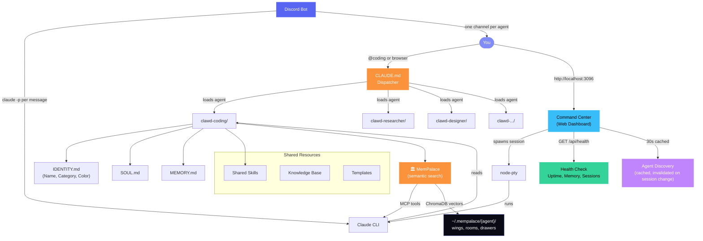
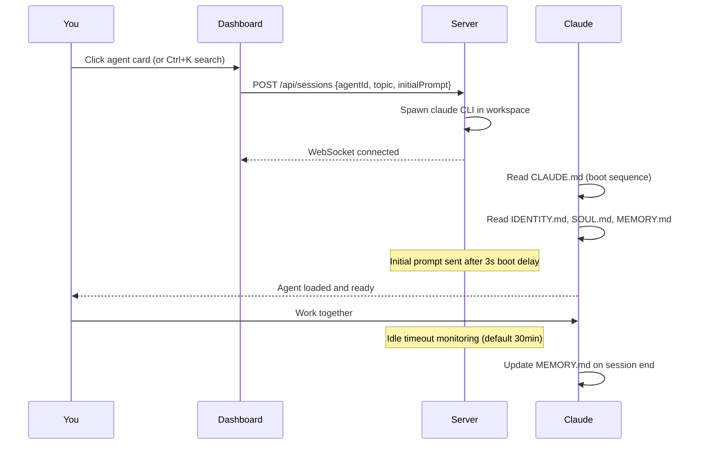

<div align="center">


### The open-source OpenClaw alternative — built for Claude subscribers.

*No API keys. No per-token billing. Your Claude subscription powers a full fleet of persistent, memory-enabled agents.*

[](https://github.com/Source-Code-Alpha/ClawHive/stargazers)
[](LICENSE)
[](https://claude.ai)
[](agents/)
[](#command-center-features)
[](CONTRIBUTING.md)

</div>

---

## The Problem

Every Claude Code session starts blank. You re-explain your project, your preferences, your active work — every single time. The agent forgets who you are, what you're building, what you decided yesterday. After 50 sessions you've spent more time briefing the agent than working with it.

## The Fix

**ClawHive guarantees memory persistence.** Every agent in ClawHive:

1. **Auto-loads** its identity (`IDENTITY.md`), personality (`SOUL.md`), operating manual (`AGENTS.md`), context about you (`USER.md`), tools (`TOOLS.md`), and long-term memory (`MEMORY.md`) on **every single session**. The command center forces this — Claude reads the files before doing anything else.

2. **Auto-saves** what happened — when a session ends (any way), the last 80 lines of the conversation are automatically appended to `memory/YYYY-MM-DD.md`. You never have to remember to "update memory."

3. **Shows freshness at a glance** — every agent card has a colored dot: green (memory updated today), amber (this week), red (stale), gray (never). You can see which agents are warm vs cold across your whole fleet.

The result: agents that actually feel like they know you, project by project, week after week.

---

## ClawHive vs OpenClaw

OpenClaw is a powerful gateway — but it requires API keys, per-token billing, and a Python/Node infrastructure stack. **ClawHive runs entirely on your existing Claude subscription.** If you're paying for Claude Pro ($20/mo) or Claude Max ($100-200/mo), you already have everything you need.

| | ClawHive | OpenClaw |
|---|---|---|
| **Billing model** | **Your Claude subscription** — flat rate, no surprises | API keys — pay per token (`ANTHROPIC_API_KEY` required) |
| **Setup** | `git clone` + `npm install` + done | `npm install -g` + `openclaw onboard` + configure API keys + configure channels |
| **Runtime** | Claude Code (`claude -p`) — the same CLI you already use | Custom gateway daemon on port 18789 |
| **Agent identity** | 6 markdown files per agent — no code, no config, just `.md` | JSON config + plugin system |
| **Memory** | `MEMORY.md` auto-saved every session + [MemPalace semantic search](#mempalace--semantic-memory-new) | Plugin-based (memory-core / memory-lancedb) |
| **Web dashboard** | Built-in — 40 features, xterm.js terminals, themes, command palette | Control UI (Lit-based, separate from chat) |
| **Discord** | [Built-in bridge](#discord-bot-new) — one channel per agent, streaming, slash commands | Plugin (requires separate configuration) |
| **Model** | Always Opus (or any Claude model via `--model` flag) | 30+ LLM providers (Anthropic, OpenAI, Gemini, etc.) |
| **Multi-LLM** | Claude-focused (multi-LLM planned) | Yes — 30+ providers |
| **Best for** | **Claude subscribers who want persistent, role-specialized agents that just work** | Power users who need multi-LLM routing and 20+ messaging channels |

**The trade-off is honest:** OpenClaw has broader LLM and channel support. ClawHive has deeper agent persistence, zero-config identity, and runs on the subscription you're already paying for. Pick the one that matches how you actually work.

---

## Screenshots

<div align="center">

### Dashboard

*Agent grid with category grouping, accent colors, topic chips, and recent sessions strip.*


<br/>

### Terminal Session

*Live Claude session with breadcrumb navigation, session tabs, and per-agent accent theming.*


<br/>

### Command Palette

*Ctrl+K fuzzy search across agents, topics, and commands — instant access to everything.*


<br/>

### Theme Variants

*Three built-in themes: Midnight (indigo), Ocean (blue), Obsidian (amber). Plus custom accent color picker.*


</div>

---

## Why Use ClawHive?

| | What ClawHive does | What's missing without it |
|---|---|---|
| **🧠 Memory** | Forces identity load on every session, auto-saves on exit | You re-brief Claude every time |
| **👥 Specialists** | 8 distinct agents (coding, research, social, finance, etc.) | One generalist that's mediocre at everything |
| **🎨 Web Dashboard** | Multi-tab terminal sessions, themes, command palette, search | Terminal-only, lose context when you switch projects |
| **🔍 Inspect** | View/edit any agent's identity, memory, topics from the browser | Manually `cat` files to understand state |
| **🎯 Topics** | Separate memory streams per project per agent | All projects bleed into one memory file |
| **📡 Webhooks** | External services trigger sessions, sessions trigger external services | Manual everything |
| **🎙 Voice** | Push-to-talk via browser Speech API | Type everything |
| **🔌 Skills** | Browse and run reusable capability modules across agents | Re-explain methodologies each session |
| **💬 Discord** | One channel per agent, persistent sessions, chat from your phone | Tied to a desktop browser |
| **🏛️ MemPalace** | Semantic search across all agent memories — "what did we decide about X?" | Grep through files or re-ask the question |

---

## Quick Start

### 1. Clone

```bash
git clone https://github.com/Source-Code-Alpha/ClawHive.git
cd ClawHive
```

### 2. Setup

```bash
# Linux / Mac
./scripts/setup.sh

# Windows (PowerShell)
.\scripts\setup.ps1
```

### Prerequisites

Before running setup, make sure you have:

- **Node.js 20+** (`node --version`) — required for the command center
- **Claude Code CLI** (`claude --version`) — install with `npm i -g @anthropic-ai/claude-code`
- **Git** (`git --version`)
- **Build tools** (only if you want the command center):
  - Windows: Visual Studio Build Tools or `npm install --global windows-build-tools`
  - macOS: Xcode Command Line Tools (`xcode-select --install`)
  - Linux: `build-essential` and `python3`

The command center uses `node-pty`, which compiles native modules. If `npm install` fails, see [TROUBLESHOOTING.md](TROUBLESHOOTING.md).

**Run the preflight check first:**

```bash
./scripts/verify.sh        # Linux / macOS
.\scripts\verify.ps1        # Windows
```

It checks Node version, Claude CLI, build tools, ports, and disk space — and tells you what is missing before you waste time on a failed install.

### Skip the install — run the dashboard in Docker

If you do not want to deal with `node-pty` build issues, run the command center as a container:

```bash
cd command-center
docker compose up -d
# Open http://localhost:3096
```

Edit `docker-compose.yml` to point at your agent workspaces. Container ships with the Claude Code CLI pre-installed.

### 3. Launch an Agent

```bash
# From terminal — cd into any agent and run claude
cd ~/clawd-coding
claude
```

The agent will read its CLAUDE.md, IDENTITY.md, SOUL.md, AGENTS.md, USER.md, TOOLS.md, and MEMORY.md before responding. It actually knows who it is.

### 4. Or Use the Command Center (web dashboard)

```bash
cd ~/clawhive-command-center
npm install     # First time only — compiles node-pty
npx tsx server/index.ts
# Open http://localhost:3096
```

Once the dashboard loads, try:

- **Ctrl+K** — fuzzy-search agents, topics, skills, commands
- **?** — show all keyboard shortcuts
- **Right-click** any agent card for a context menu
- **Double-click** an agent card to open the detail panel with metrics
- Click the **theme button** in the header to cycle Midnight / Ocean / Obsidian
- Click the **heart icon** in the header to see the health of all your agents

---

## Architecture



### How an Agent Session Works



---

## Command Center Features

The command center ships with **40 built-in features** across six categories. Every feature works out of the box with zero configuration.

### Navigation & Search

| # | Feature | Description |
|---|---------|-------------|
| 1 | **Command Palette** | `Ctrl+K` opens a fuzzy-search overlay for agents, topics, and commands |
| 2 | **Keyboard Shortcuts Overlay** | Press `?` anywhere to see all available shortcuts |
| 3 | **Breadcrumb Navigation** | `Dashboard > Agent > Topic` trail in terminal view -- click to navigate back |
| 4 | **Sort Dropdown** | Sort agents by name, category, or topic count |
| 5 | **Dynamic Filter Chips** | Category filters generated at runtime from actual agent `Category:` fields |
| 6 | **Responsive Search Row** | Search bar and sort controls reflow cleanly on any screen size |

### Agent Management

| # | Feature | Description |
|---|---------|-------------|
| 7 | **Agent Detail Panel** | Double-click a card for a slide-out with identity, topics, last activity, and launch button |
| 8 | **Quick-Launch Topics** | Click any topic chip on a card to launch directly into that agent+topic session |
| 9 | **Pin / Favorite Agents** | Star agents to pin them to the top of the grid (persisted in localStorage) |
| 10 | **Context Menu** | Right-click any agent card for actions: launch, launch with topic, view details |
| 11 | **Quick Prompt Mode** | Launch an agent with a starting prompt via the context menu |
| 12 | **Agent Accent Colors** | Each agent can define a `Color:` in IDENTITY.md for personalized card borders and glows |
| 13 | **Agent Last-Active** | Detail panel shows when an agent was last used |
| 14 | **Empty States** | Helpful messages when no agents are found or no search results match |

### Session Management

| # | Feature | Description |
|---|---------|-------------|
| 15 | **Session Status Indicators** | Green (active), amber (idle >2min), red (disconnected) dots on each tab |
| 16 | **Session Timer** | Elapsed time displayed on every session tab, updating each minute |
| 17 | **Recent Sessions** | Strip above the agent grid showing the last 5 closed sessions with duration |
| 18 | **Session History** | Full session history in the recent sessions strip |
| 19 | **Initial Prompt on Launch** | Send a prompt to the agent after Claude boots (3-second delay for stability) |
| 20 | **Session Idle Timeout** | Auto-kill sessions after 30 minutes idle (configurable via `IDLE_TIMEOUT` env var) |
| 21 | **Session Persistence** | Improved session state tracking across browser refreshes |
| 22 | **Export Session** | Download terminal output as a `.md` file from the terminal header |

### Terminal Experience

| # | Feature | Description |
|---|---------|-------------|
| 23 | **Terminal Accent Per Agent** | Cursor and selection color match the agent's accent color |
| 24 | **Terminal Search** | `Ctrl+F` to search within terminal output (xterm search addon) |
| 25 | **Auto-Scroll Toggle** | Pause/resume auto-scroll button in the terminal header |
| 26 | **Smooth View Transitions** | Fade/slide animations between dashboard and terminal views |

### Dashboard & Theming

| # | Feature | Description |
|---|---------|-------------|
| 27 | **Theme System** | 3 built-in themes: **Midnight** (default purple), **Ocean** (blue), **Obsidian** (warm) |
| 28 | **Dashboard Stats Bar** | Live counters showing total agents, active sessions, memory usage, and uptime |
| 29 | **Compact / List View** | Toggle between card grid and dense list view for power users |
| 30 | **Toast Notifications** | Non-blocking toasts for session started, ended, crashed, and max sessions reached |
| 31 | **Favicon Badge** | Active session count shown as a badge on the browser tab favicon |
| 32 | **Browser Notifications** | Desktop alerts when a session ends in a background tab |
| 33 | **PWA Install Prompt** | "Install App" button appears when the browser supports Progressive Web Apps |
| 34 | **Particle Background** | Animated particle canvas with glassmorphic design |

### Backend & Security

| # | Feature | Description |
|---|---------|-------------|
| 35 | **Health Check Endpoint** | `GET /api/health` returns uptime, memory usage, active sessions, and agent count |
| 36 | **XSS Protection** | All dynamic content escaped -- no raw string interpolation in HTML |
| 37 | **Input Validation** | `agentId`, `topic`, `cols`, `rows` validated on every API call |
| 38 | **Agent Discovery Caching** | 30-second TTL cache, invalidated automatically on session changes |
| 39 | **Graceful Shutdown** | `SIGTERM`/`SIGINT` handlers flush history, save state, and close connections cleanly |
| 40 | **Prefers-Reduced-Motion** | Respects OS accessibility setting -- disables all animations including particles |

### Keyboard Shortcuts

| Shortcut | Action |
|----------|--------|
| `Ctrl+K` | Open command palette |
| `?` | Show keyboard shortcuts overlay |
| `/` | Focus search bar |
| `Esc` | Close modal / return to dashboard |
| `Ctrl+1` through `Ctrl+8` | Switch to session tab 1-8 |
| `Ctrl+F` | Search within terminal output |
| Right-click agent card | Open context menu |
| Double-click agent card | Open agent detail panel |

---

## Discord Bot (NEW)

A standalone Discord bridge ships with the command center. Chat with any agent from your phone, get a daily activity digest, run quick one-shots — all over Discord.

| Feature | What it does |
|---|---|
| **One channel per agent** | The bot maps Discord channel names to agent IDs. `#engineering` → `engineering` agent. Run `/setup` once and the bot auto-creates a channel for every ClawHive agent. |
| **Persistent sessions** | Every channel keeps its own Claude session UUID. Conversations survive bot restarts and resume cleanly via `claude --resume <uuid>`. |
| **Always Opus** | The bot spawns Claude with `--model opus` regardless of dashboard defaults. |
| **Conversational tone** | Every message is sent with a system prompt telling the agent to reply like it's texting a colleague — no terminal banners, no status lines, just clean prose. |
| **File uploads** | Drop a file in any agent channel — the bot uploads it to that agent's `uploads/` folder and tells the agent to read it. |
| **Daily digest** | Auto-posts a summary of yesterday's sessions, memory updates, and topics created to the `#daily` channel every morning. |
| **Slash commands** | `/setup`, `/agents`, `/quick`, `/status`, `/end`, `/digest`, `/health`. |
| **Whitelist auth** | Single Discord user ID allow-list. Anyone else in your server gets a polite "private bot" reply. |

**Why this is different from typical Discord bots:** instead of trying to scrape clean output from a TUI session, the bot spawns `claude -p` directly per message, captures stdout, and posts the result. There is no PTY, no terminal scraping, no ANSI parsing — just clean markdown from Claude piped to Discord.

```
You ──▶ Discord gateway (WS) ──▶ Bot ──spawn──▶ claude -p (subprocess)
                                  │                    │
                                  │                    ▼
                                  │            Clean stdout (markdown)
                                  ◀────────── send to channel
```

Setup is documented in `command-center/discord-bot/README.md`. The bot is a separate Node process from the command center — you can run it on a different machine, disable it without affecting the dashboard, and crash it without taking anything else down.

---

## MemPalace — Semantic Memory (NEW)

Every ClawHive agent accumulates `MEMORY.md` files, daily scrollbacks, and topic-specific notes across sessions. Without search, finding "what did we decide about pricing last month?" means grepping through dozens of files. **MemPalace makes every memory semantically searchable — no API keys required.**

### How it works

[MemPalace](https://github.com/milla-jovovich/mempalace) stores agent memories as verbatim "drawers" in a local ChromaDB vector database, organized into a navigable hierarchy that maps directly onto ClawHive's agent model:

| MemPalace concept | ClawHive equivalent |
|---|---|
| **Wing** | One agent (`coding`, `researcher`, `finance`...) |
| **Room** | One topic within an agent (`homelab`, `exports`, `pricing`) |
| **Drawer** | One memory entry (a day's scrollback, a MEMORY.md section) |
| **Tunnel** | A shared topic discovered across multiple agents |

All data stays local at `~/.mempalace/{agent}/`. No cloud. No API keys. No telemetry. MIT licensed.

### What it gives your agents

| Capability | How |
|---|---|
| **"What did we decide about X?"** | `mempalace search "pricing strategy" --wing coding` returns semantically ranked verbatim snippets from that agent's memory |
| **Cross-agent recall** | `mempalace search "UAE expansion" --wing operations` finds what your ops agent knows, even from a session 3 weeks ago |
| **Cold-start grounding** | `mempalace wake-up --wing coding` outputs ~800 tokens of critical facts to inject into a new session — the agent walks in warm |
| **Temporal queries** | The built-in knowledge graph tracks `valid_from` / `valid_until` on facts — "what was true in February?" is a supported query |
| **MCP-native** | Agents call `mempalace_search`, `mempalace_kg_query`, `mempalace_add_drawer` as native tools during any session. No glue code. |

### Setup — one command per agent

```bash
# 1. Install (once)
pip install mempalace

# 2. Onboard an agent (30 seconds each)
bash scripts/mempalace-onboard-agent.sh coding

# What this does:
#   - Mines the agent's memory/ daily files + MEMORY.md into a palace
#   - Registers the MemPalace MCP server for that agent's workspace
#   - The agent's Claude sessions now have 19 memory tools available automatically
```

Or manually:

```bash
# Mine an agent's memory
mempalace --palace ~/.mempalace/coding mine ~/clawd-coding/memory --mode convos --extract general --wing coding

# Register the MCP server
cd ~/clawd-coding
claude mcp add mempalace -- python -m mempalace.mcp_server --palace ~/.mempalace/coding

# Test a search
mempalace --palace ~/.mempalace/coding search "refactoring the auth module"
```

### Architecture

```
Agent session (claude -p or dashboard)
    │
    ├── reads CLAUDE.md, IDENTITY.md, SOUL.md, MEMORY.md  (boot)
    │
    ├── calls mempalace_search("pricing discussion")       (MCP tool)
    │       └── ChromaDB vector search → ranked drawers
    │
    ├── calls mempalace_kg_query("UAE contacts")           (MCP tool)
    │       └── SQLite knowledge graph → entity timeline
    │
    └── calls mempalace_add_drawer(new_memory)             (MCP tool)
            └── indexed for future sessions

All 19 MCP tools are stdio-based. No ports. No daemons. Zero infrastructure.
```

MemPalace is **additive** — it reads your existing `.md` files without modifying them. The palace is a search index alongside your source-of-truth markdown, not a replacement for it.

---

## Meet the Agents

<div align="center">

| | Agent | Role | Personality |
|---|---|---|---|
| 🧑‍💻 | **Codesmith** | VP of Engineering | Opinionated, fast, convention-first. Ships clean code. |
| 🔍 | **Oracle** | Director of Intelligence | Methodical, evidence-first. Goes deep before going wide. |
| 📱 | **Pulse** | Social Media Manager | Creative, trend-aware. Thinks in hooks and engagement. |
| 🌱 | **Sage** | Life & Wellness Coach | Warm, habit-focused. Nudges without nagging. |
| 🎯 | **Architect** | Prompt Engineer | Meta-cognitive, precise. Optimizes how you talk to AI. |
| 🎨 | **Atelier** | Creative Director | Visual thinker, brand-conscious. Design with intention. |
| 🛡️ | **Sentinel** | Quality Auditor | Strict, thorough. Catches what others miss. |
| 💰 | **Ledger** | Financial Analyst | Conservative, data-driven. Numbers don't lie. |

</div>

---

## The Agent DNA

Every agent is defined by 6 markdown files. No code. No config files. Just `.md`.

```
clawd-{agent}/
├── CLAUDE.md       # Boot sequence -- what to read and in what order
├── IDENTITY.md     # Name, emoji, role, category, color -- who the agent IS
├── SOUL.md         # Personality, values, communication style
├── AGENTS.md       # Operating manual, SOPs, responsibilities
├── USER.md         # About YOU -- so the agent can tailor its help
├── TOOLS.md        # Environment, services, credentials
├── MEMORY.md       # Long-term memory (auto-updated each session)
├── memory/         # Daily session notes (YYYY-MM-DD.md)
└── topics/         # Project-scoped work
    └── my-project/
        ├── TOPIC.md    # Project context
        └── MEMORY.md   # Project-specific memory
```

**This is the key insight:** agents are *just markdown files*. No frameworks, no databases, no deployment pipelines. Claude Code reads them and becomes that agent. You customize an agent by editing text files.

### IDENTITY.md Powers the Dashboard

The `IDENTITY.md` file does double duty -- it defines the agent's identity for Claude **and** provides metadata for the Command Center:

| Field | Example | Used For |
|-------|---------|----------|
| `Name:` | `Codesmith` | Card title, tab label |
| `Emoji:` | `🧑‍💻` | Card icon |
| `Role:` | `VP of Engineering` | Card subtitle |
| `Vibe:` | `Fast, opinionated, clean` | Detail panel |
| `Category:` | `engineering` | Dynamic filter chips on dashboard |
| `Color:` | `#818cf8` | Card border, glow, terminal cursor accent |

---

## Command Center

The web dashboard gives you a visual interface for managing all your agents.

**Features:**
- Click any agent card to launch a live terminal session
- Multiple concurrent sessions with tab switching
- Sessions persist when you close the browser -- reconnect and pick up where you left off
- Command palette (Ctrl+K) for instant agent/topic search
- Pin favorite agents to the top of the grid
- 3 themes: Midnight, Ocean, Obsidian
- Dynamic category filter chips from agent IDENTITY.md
- Category-grouped cards with per-agent accent colors
- Compact list view for power users
- Dashboard stats bar with live agent/session/memory/uptime counters
- Export terminal output as markdown
- Terminal search (Ctrl+F) with xterm search addon
- Health check endpoint at `/api/health`
- PWA-installable from supported browsers
- Mobile-friendly with sticky header and bottom tabs
- Particle background and glassmorphic design

**Tech stack:** Express.js + node-pty + xterm.js + WebSocket. No frameworks. No build step.

---

## Add Your Own Agent

```bash
./scripts/add-agent.sh
```

It will prompt you for a name, emoji, role, and personality -- then create the full workspace with all template files. The command center discovers new agents automatically on the next API call.

Or do it manually:

1. Copy `templates/agent/` to `~/clawd-{your-agent}/`
2. Edit `IDENTITY.md` with your agent's name, emoji, role
3. Add `Category:` for dashboard filtering (e.g., `Category: engineering`)
4. Add `Color:` for accent color (e.g., `Color: #7c4dff`)
5. Edit `SOUL.md` with the personality you want
6. Done. The system discovers it automatically.

---

## Skills

Skills are reusable capability modules that any agent can access. Each skill is a directory with a `SKILL.md` definition and optional scripts.

```
skills/
├── code-review/
│   └── SKILL.md        # Instructions for how to do code reviews
├── architecture/
│   └── SKILL.md        # Software architecture patterns
├── brainstorming/
│   └── SKILL.md        # Structured brainstorming methodology
└── ...
```

---

## Deployment Options

### Local (simplest)
```bash
./scripts/setup.sh
cd ~/clawhive-command-center && npx tsx server/index.ts
```

### Homelab (recommended)
Run the command center as a service, set up local DNS (e.g., `ai.local`), and access from any device on your network.

### Docker
```bash
cd command-center
docker build -t clawhive .
docker run -d -p 3096:3096 -v $HOME:/home/user clawhive
```

### Environment Variables

| Variable | Default | Description |
|----------|---------|-------------|
| `PORT` | `3096` | HTTP/WebSocket port |
| `CLAUDE_BIN` | `claude` | Path to Claude CLI binary |
| `WORKSPACE_PREFIX` | `clawd-` | Directory prefix for agent workspaces |
| `SKIP_DIRS` | *(empty)* | Comma-separated workspace names to ignore |
| `MAX_SESSIONS` | `8` | Maximum concurrent PTY sessions |
| `IDLE_TIMEOUT` | `1800` | Seconds before idle sessions are auto-killed |
| `HISTORY_DIR` | `~/.clawhive/history` | Session log file directory |

See [docs/deployment.md](docs/deployment.md) for the full deployment guide.

---

## Project Structure

```
ClawHive/
├── README.md                 # You are here
├── LICENSE                   # MIT
├── dispatcher/
│   └── CLAUDE.md             # Root dispatcher configuration
├── agents/                   # 8 ready-to-use agents
│   ├── coding/
│   ├── researcher/
│   ├── social/
│   ├── life/
│   ├── prompter/
│   ├── designer/
│   ├── auditor/
│   └── finance/
├── command-center/           # Web dashboard (40 features)
│   ├── server/               # Express + WebSocket + node-pty + health check
│   ├── public/               # HTML + CSS + xterm.js + themes
│   └── discord-bot/          # Discord bridge (one channel per agent, streaming)
├── skills/                   # Shared capability modules
├── templates/                # Blank templates for new agents
├── scripts/                  # Setup, add-agent, mempalace onboarding
│   └── mempalace-onboard-agent.sh  # One-command memory setup per agent
└── docs/                     # Architecture and guides
```

---

## Roadmap

- [x] ~~Dashboard themes~~ (shipped: Midnight, Ocean, Obsidian)
- [x] ~~Voice input (push-to-talk)~~ (shipped via Web Speech API)
- [x] ~~Memory persistence with auto-save~~ (shipped)
- [x] ~~Webhook receiver and outgoing webhooks~~ (shipped)
- [x] ~~Discord bidirectional integration~~ (shipped: one channel per agent, streaming output, slash commands)
- [x] ~~Semantic memory search~~ (shipped: MemPalace integration — ChromaDB vectors + knowledge graph, MCP-native)
- [x] ~~Always-Opus default~~ (shipped: all sessions spawn with `--model opus`)
- [ ] Multi-LLM router (Anthropic + OpenAI + Gemini + Ollama)
- [ ] OpenAI-compatible `/v1/chat/completions` API
- [ ] MCP server mode (expose agents as tools for other Claude sessions)
- [ ] Cross-agent message bus and context handoff
- [ ] One-click cloud deployment (Railway / Fly button)
- [ ] Plugin system for custom dashboard widgets
- [ ] Community agent marketplace

---

## Known Limitations

ClawHive is young and built fast. Here is what is not great yet, in honest terms:

**Install**
- `node-pty` compilation can fail on Windows without Visual Studio Build Tools — see [TROUBLESHOOTING.md](TROUBLESHOOTING.md)
- First-run install on a clean machine is not bulletproof; expect to read the troubleshooting guide
- We have not run automated install tests on every OS/Node combination

**Dashboard / Sessions**
- The `Quick Chat` feature spawns a fresh PTY and waits for stable output; it works most of the time but can return truncated responses on slow first-boots
- `Voice input` requires Chrome / Edge / a Chromium-based browser — Firefox is not supported
- `Session replay` is scaffolded but lightly tested
- No authentication on the API by default; you can opt in by setting `CLAWHIVE_TOKEN` (see [TROUBLESHOOTING.md](TROUBLESHOOTING.md))
- `Skill execution` only works for skills with a runnable script in `scripts/`. Pure-markdown skills can be browsed but not "run."

**Memory**
- Auto-save dumps the last 80 lines of raw scrollback into `memory/YYYY-MM-DD.md`. It is honest but verbose.
- **With MemPalace enabled**, all memory files become semantically searchable — agents can find past decisions, pricing discussions, and project context across sessions without you pointing at specific files. Run `scripts/mempalace-onboard-agent.sh {agent}` to set it up per agent.
- Force boot sequence sends a prompt 4 seconds after Claude starts. On very slow machines, this can race with Claude's own boot output.

**Mobile**
- Installable as a PWA but the dashboard is desktop-first
- Voice input does not work on iOS Safari
- Some overlays (workspace inspector) are tight on screens narrower than 380px

**Cross-agent**
- Multi-agent broadcast is real
- Agent-to-agent messaging is not (each session is isolated)

We tell you all this up front because we would rather you know than be surprised. PRs and issues welcome on any of it.

---

## Contributing

We welcome contributions! Whether it's a new agent, a skill, a bug fix, or documentation improvement.

See [CONTRIBUTING.md](CONTRIBUTING.md) for guidelines.

**Ideas for contributions:**
- Create a new agent with an interesting personality
- Build a useful skill module
- Improve the command center UI
- Add a new theme
- Write documentation or tutorials

---

## License

MIT -- see [LICENSE](LICENSE).

---

<div align="center">

**Built with [Claude Code](https://claude.ai/code) by [Source Code Alpha](https://github.com/Source-Code-Alpha)**

If ClawHive is useful to you, consider giving it a star -- it helps others discover it.

[](https://github.com/Source-Code-Alpha/ClawHive)


</div>
