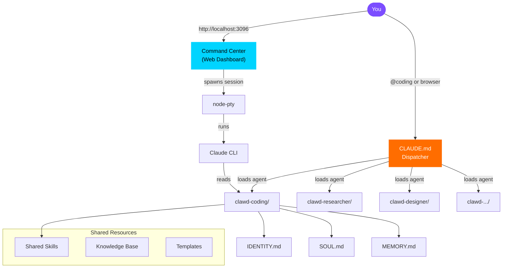
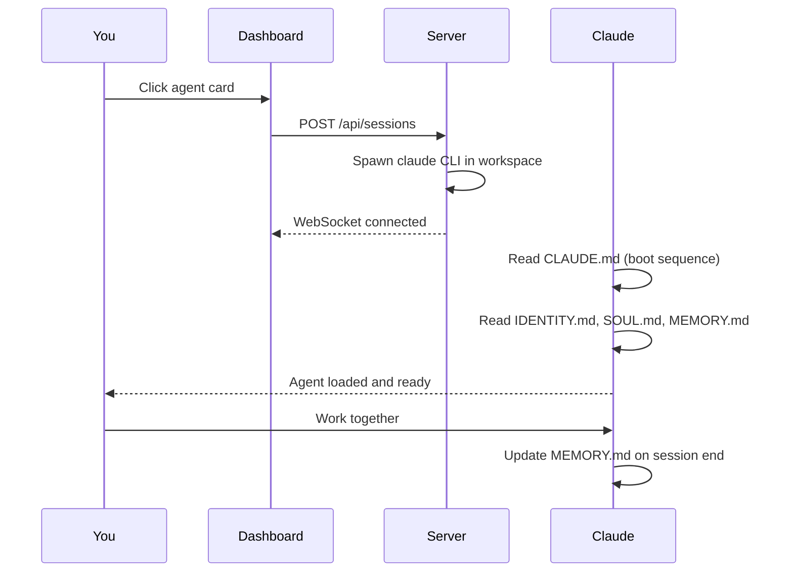

<div align="center">


**8 specialized AI agents. One command center. Infinite possibilities.**

[](https://github.com/Source-Code-Alpha/ClawHive/stargazers)
[](LICENSE)
[](agents/)
[](CONTRIBUTING.md)
[](https://claude.ai/code)

</div>

---

## What is ClawHive?

ClawHive is a **multi-agent framework for Claude Code** that lets you run specialized AI agents -- each with its own personality, memory, skills, and expertise -- from a single dispatcher. Switch between a coding architect, a research analyst, a creative director, and more with a single command.

It comes with a **web-based command center** where you can launch, manage, and switch between agent sessions from any browser.

<div align="center">

| Feature | Description |
|---------|-------------|
| **Multi-Agent System** | 8 specialized agents with distinct personalities and expertise |
| **Persistent Memory** | Agents remember across sessions -- decisions, context, and preferences |
| **Web Command Center** | Beautiful dark-themed dashboard with live terminals in your browser |
| **Topic Isolation** | Work on multiple projects per agent, each with its own memory |
| **Extensible** | Add new agents in 30 seconds with `./scripts/add-agent.sh` |
| **Zero Config** | Agents auto-discover from the filesystem. No database. No setup. |

</div>

---

## Quick Start

### 1. Clone

```bash
git clone https://github.com/Source-Code-Alpha/ClawHive.git
cd ClawHive
```

### 2. Setup

```bash
# Linux / Mac
./scripts/setup.sh

# Windows (PowerShell)
.\scripts\setup.ps1
```

### 3. Launch an Agent

```bash
# From terminal -- just cd into any agent and run claude
cd ~/clawd-coding
claude
```

### 4. Or Use the Command Center

```bash
cd ~/clawhive-command-center
npx tsx server/index.ts
# Open http://localhost:3096
```

---

## Architecture



### How an Agent Session Works



---

## Meet the Agents

<div align="center">

| | Agent | Role | Personality |
|---|---|---|---|
| 🧑‍💻 | **Codesmith** | VP of Engineering | Opinionated, fast, convention-first. Ships clean code. |
| 🔍 | **Oracle** | Director of Intelligence | Methodical, evidence-first. Goes deep before going wide. |
| 📱 | **Pulse** | Social Media Manager | Creative, trend-aware. Thinks in hooks and engagement. |
| 🌱 | **Sage** | Life & Wellness Coach | Warm, habit-focused. Nudges without nagging. |
| 🎯 | **Architect** | Prompt Engineer | Meta-cognitive, precise. Optimizes how you talk to AI. |
| 🎨 | **Atelier** | Creative Director | Visual thinker, brand-conscious. Design with intention. |
| 🛡️ | **Sentinel** | Quality Auditor | Strict, thorough. Catches what others miss. |
| 💰 | **Ledger** | Financial Analyst | Conservative, data-driven. Numbers don't lie. |

</div>

---

## The Agent DNA

Every agent is defined by 6 markdown files. No code. No config files. Just `.md`.

```
clawd-{agent}/
├── CLAUDE.md       # Boot sequence -- what to read and in what order
├── IDENTITY.md     # Name, emoji, role, vibe -- who the agent IS
├── SOUL.md         # Personality, values, communication style
├── AGENTS.md       # Operating manual, SOPs, responsibilities
├── USER.md         # About YOU -- so the agent can tailor its help
├── TOOLS.md        # Environment, services, credentials
├── MEMORY.md       # Long-term memory (auto-updated each session)
├── memory/         # Daily session notes (YYYY-MM-DD.md)
└── topics/         # Project-scoped work
    └── my-project/
        ├── TOPIC.md    # Project context
        └── MEMORY.md   # Project-specific memory
```

**This is the key insight:** agents are *just markdown files*. No frameworks, no databases, no deployment pipelines. Claude Code reads them and becomes that agent. You customize an agent by editing text files.

---

## Command Center

The web dashboard gives you a visual interface for managing all your agents.

**Features:**
- Click any agent card to launch a live terminal session
- Multiple concurrent sessions with tab switching
- Sessions persist when you close the browser -- reconnect and pick up where you left off
- Search and filter agents by category
- Category-grouped cards with accent colors
- Mobile-friendly with sticky header and bottom tabs
- Particle background and glassmorphic design

**Tech stack:** Express.js + node-pty + xterm.js + WebSocket. No frameworks. No build step.

---

## Add Your Own Agent

```bash
./scripts/add-agent.sh
```

It will prompt you for a name, emoji, role, and personality -- then create the full workspace with all template files. The command center discovers new agents automatically on the next API call.

Or do it manually:

1. Copy `templates/agent/` to `~/clawd-{your-agent}/`
2. Edit `IDENTITY.md` with your agent's name, emoji, role
3. Edit `SOUL.md` with the personality you want
4. Done. The system discovers it automatically.

---

## Skills

Skills are reusable capability modules that any agent can access. Each skill is a directory with a `SKILL.md` definition and optional scripts.

```
skills/
├── code-review/
│   └── SKILL.md        # Instructions for how to do code reviews
├── architecture/
│   └── SKILL.md        # Software architecture patterns
├── brainstorming/
│   └── SKILL.md        # Structured brainstorming methodology
└── ...
```

---

## Deployment Options

### Local (simplest)
```bash
./scripts/setup.sh
cd ~/clawhive-command-center && npx tsx server/index.ts
```

### Homelab (recommended)
Run the command center as a service, set up local DNS (e.g., `ai.local`), and access from any device on your network.

### Docker
```bash
cd command-center
docker build -t clawhive .
docker run -d -p 3096:3096 -v $HOME:/home/user clawhive
```

---

## Project Structure

```
ClawHive/
├── README.md                 # You are here
├── LICENSE                   # MIT
├── dispatcher/
│   └── CLAUDE.md             # Root dispatcher configuration
├── agents/                   # 8 ready-to-use agents
│   ├── coding/
│   ├── researcher/
│   ├── social/
│   ├── life/
│   ├── prompter/
│   ├── designer/
│   ├── auditor/
│   └── finance/
├── command-center/           # Web dashboard
│   ├── server/               # Express + WebSocket + node-pty
│   └── public/               # HTML + CSS + xterm.js
├── skills/                   # Shared capability modules
├── templates/                # Blank templates for new agents
├── scripts/                  # Setup, add-agent, backup utilities
└── docs/                     # Architecture and guides
```

---

## Roadmap

- [ ] Community agent marketplace
- [ ] Agent-to-agent communication protocol
- [ ] Voice interface (push-to-talk)
- [ ] Dashboard themes
- [ ] Skill marketplace
- [ ] One-click cloud deployment

---

## Contributing

We welcome contributions! Whether it's a new agent, a skill, a bug fix, or documentation improvement.

See [CONTRIBUTING.md](CONTRIBUTING.md) for guidelines.

**Ideas for contributions:**
- Create a new agent with an interesting personality
- Build a useful skill module
- Improve the command center UI
- Write documentation or tutorials

---

## License

MIT -- see [LICENSE](LICENSE).

---

<div align="center">

**Built with [Claude Code](https://claude.ai/code) by [Source Code Alpha](https://github.com/Source-Code-Alpha)**

If ClawHive is useful to you, consider giving it a star -- it helps others discover it.

[](https://github.com/Source-Code-Alpha/ClawHive)


</div>
