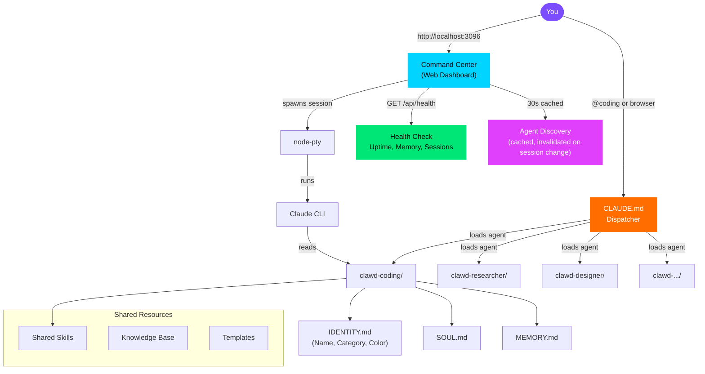
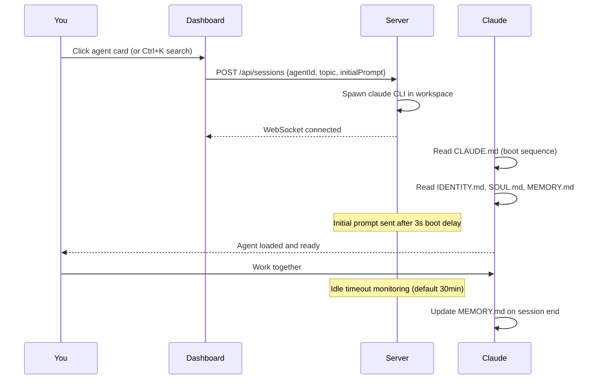

<div align="center">


**8 specialized AI agents. One command center. 40 features. Infinite possibilities.**

[](https://github.com/Source-Code-Alpha/ClawHive/stargazers)
[](LICENSE)
[](agents/)
[](#command-center-features)
[](CONTRIBUTING.md)
[](https://claude.ai/code)

</div>

---

## What is ClawHive?

ClawHive is a **multi-agent framework for Claude Code** that lets you run specialized AI agents -- each with its own personality, memory, skills, and expertise -- from a single dispatcher. Switch between a coding architect, a research analyst, a creative director, and more with a single command.

It comes with a **web-based command center** -- a full-featured dashboard with themes, keyboard shortcuts, a command palette, live session management, and more. Think of it as mission control for your AI workforce.

<div align="center">

| Feature | Description |
|---------|-------------|
| **Multi-Agent System** | 8 specialized agents with distinct personalities and expertise |
| **Persistent Memory** | Agents remember across sessions -- decisions, context, and preferences |
| **Web Command Center** | Feature-rich dark-themed dashboard with 40 built-in capabilities |
| **Topic Isolation** | Work on multiple projects per agent, each with its own memory |
| **3 Themes** | Midnight (default), Ocean (blue), and Obsidian (warm) |
| **Command Palette** | Ctrl+K to fuzzy-search agents, topics, and commands instantly |
| **Pin Favorites** | Star your most-used agents to keep them pinned at the top |
| **Keyboard-First** | Full keyboard shortcut system -- press `?` for the overlay |
| **PWA Ready** | Install as a native app from the browser |
| **Extensible** | Add new agents in 30 seconds with `./scripts/add-agent.sh` |
| **Zero Config** | Agents auto-discover from the filesystem. No database. No setup. |

</div>

---

## Quick Start

### 1. Clone

```bash
git clone https://github.com/Source-Code-Alpha/ClawHive.git
cd ClawHive
```

### 2. Setup

```bash
# Linux / Mac
./scripts/setup.sh

# Windows (PowerShell)
.\scripts\setup.ps1
```

### 3. Launch an Agent

```bash
# From terminal -- just cd into any agent and run claude
cd ~/clawd-coding
claude
```

### 4. Or Use the Command Center

```bash
cd ~/clawhive-command-center
npx tsx server/index.ts
# Open http://localhost:3096
```

Once the dashboard loads, try these right away:

- **Ctrl+K** -- Open the command palette to fuzzy-search agents and commands
- **?** -- View all keyboard shortcuts
- **Right-click** any agent card for a context menu with quick actions
- **Double-click** an agent card to open the detail panel
- Click the **theme button** in the header to switch between Midnight, Ocean, and Obsidian

---

## Architecture



### How an Agent Session Works



---

## Command Center Features

The command center ships with **40 built-in features** across six categories. Every feature works out of the box with zero configuration.

### Navigation & Search

| # | Feature | Description |
|---|---------|-------------|
| 1 | **Command Palette** | `Ctrl+K` opens a fuzzy-search overlay for agents, topics, and commands |
| 2 | **Keyboard Shortcuts Overlay** | Press `?` anywhere to see all available shortcuts |
| 3 | **Breadcrumb Navigation** | `Dashboard > Agent > Topic` trail in terminal view -- click to navigate back |
| 4 | **Sort Dropdown** | Sort agents by name, category, or topic count |
| 5 | **Dynamic Filter Chips** | Category filters generated at runtime from actual agent `Category:` fields |
| 6 | **Responsive Search Row** | Search bar and sort controls reflow cleanly on any screen size |

### Agent Management

| # | Feature | Description |
|---|---------|-------------|
| 7 | **Agent Detail Panel** | Double-click a card for a slide-out with identity, topics, last activity, and launch button |
| 8 | **Quick-Launch Topics** | Click any topic chip on a card to launch directly into that agent+topic session |
| 9 | **Pin / Favorite Agents** | Star agents to pin them to the top of the grid (persisted in localStorage) |
| 10 | **Context Menu** | Right-click any agent card for actions: launch, launch with topic, view details |
| 11 | **Quick Prompt Mode** | Launch an agent with a starting prompt via the context menu |
| 12 | **Agent Accent Colors** | Each agent can define a `Color:` in IDENTITY.md for personalized card borders and glows |
| 13 | **Agent Last-Active** | Detail panel shows when an agent was last used |
| 14 | **Empty States** | Helpful messages when no agents are found or no search results match |

### Session Management

| # | Feature | Description |
|---|---------|-------------|
| 15 | **Session Status Indicators** | Green (active), amber (idle >2min), red (disconnected) dots on each tab |
| 16 | **Session Timer** | Elapsed time displayed on every session tab, updating each minute |
| 17 | **Recent Sessions** | Strip above the agent grid showing the last 5 closed sessions with duration |
| 18 | **Session History** | Full session history in the recent sessions strip |
| 19 | **Initial Prompt on Launch** | Send a prompt to the agent after Claude boots (3-second delay for stability) |
| 20 | **Session Idle Timeout** | Auto-kill sessions after 30 minutes idle (configurable via `IDLE_TIMEOUT` env var) |
| 21 | **Session Persistence** | Improved session state tracking across browser refreshes |
| 22 | **Export Session** | Download terminal output as a `.md` file from the terminal header |

### Terminal Experience

| # | Feature | Description |
|---|---------|-------------|
| 23 | **Terminal Accent Per Agent** | Cursor and selection color match the agent's accent color |
| 24 | **Terminal Search** | `Ctrl+F` to search within terminal output (xterm search addon) |
| 25 | **Auto-Scroll Toggle** | Pause/resume auto-scroll button in the terminal header |
| 26 | **Smooth View Transitions** | Fade/slide animations between dashboard and terminal views |

### Dashboard & Theming

| # | Feature | Description |
|---|---------|-------------|
| 27 | **Theme System** | 3 built-in themes: **Midnight** (default purple), **Ocean** (blue), **Obsidian** (warm) |
| 28 | **Dashboard Stats Bar** | Live counters showing total agents, active sessions, memory usage, and uptime |
| 29 | **Compact / List View** | Toggle between card grid and dense list view for power users |
| 30 | **Toast Notifications** | Non-blocking toasts for session started, ended, crashed, and max sessions reached |
| 31 | **Favicon Badge** | Active session count shown as a badge on the browser tab favicon |
| 32 | **Browser Notifications** | Desktop alerts when a session ends in a background tab |
| 33 | **PWA Install Prompt** | "Install App" button appears when the browser supports Progressive Web Apps |
| 34 | **Particle Background** | Animated particle canvas with glassmorphic design |

### Backend & Security

| # | Feature | Description |
|---|---------|-------------|
| 35 | **Health Check Endpoint** | `GET /api/health` returns uptime, memory usage, active sessions, and agent count |
| 36 | **XSS Protection** | All dynamic content escaped -- no raw string interpolation in HTML |
| 37 | **Input Validation** | `agentId`, `topic`, `cols`, `rows` validated on every API call |
| 38 | **Agent Discovery Caching** | 30-second TTL cache, invalidated automatically on session changes |
| 39 | **Graceful Shutdown** | `SIGTERM`/`SIGINT` handlers flush history, save state, and close connections cleanly |
| 40 | **Prefers-Reduced-Motion** | Respects OS accessibility setting -- disables all animations including particles |

### Keyboard Shortcuts

| Shortcut | Action |
|----------|--------|
| `Ctrl+K` | Open command palette |
| `?` | Show keyboard shortcuts overlay |
| `/` | Focus search bar |
| `Esc` | Close modal / return to dashboard |
| `Ctrl+1` through `Ctrl+8` | Switch to session tab 1-8 |
| `Ctrl+F` | Search within terminal output |
| Right-click agent card | Open context menu |
| Double-click agent card | Open agent detail panel |

---

## Meet the Agents

<div align="center">

| | Agent | Role | Personality |
|---|---|---|---|
| 🧑‍💻 | **Codesmith** | VP of Engineering | Opinionated, fast, convention-first. Ships clean code. |
| 🔍 | **Oracle** | Director of Intelligence | Methodical, evidence-first. Goes deep before going wide. |
| 📱 | **Pulse** | Social Media Manager | Creative, trend-aware. Thinks in hooks and engagement. |
| 🌱 | **Sage** | Life & Wellness Coach | Warm, habit-focused. Nudges without nagging. |
| 🎯 | **Architect** | Prompt Engineer | Meta-cognitive, precise. Optimizes how you talk to AI. |
| 🎨 | **Atelier** | Creative Director | Visual thinker, brand-conscious. Design with intention. |
| 🛡️ | **Sentinel** | Quality Auditor | Strict, thorough. Catches what others miss. |
| 💰 | **Ledger** | Financial Analyst | Conservative, data-driven. Numbers don't lie. |

</div>

---

## The Agent DNA

Every agent is defined by 6 markdown files. No code. No config files. Just `.md`.

```
clawd-{agent}/
├── CLAUDE.md       # Boot sequence -- what to read and in what order
├── IDENTITY.md     # Name, emoji, role, category, color -- who the agent IS
├── SOUL.md         # Personality, values, communication style
├── AGENTS.md       # Operating manual, SOPs, responsibilities
├── USER.md         # About YOU -- so the agent can tailor its help
├── TOOLS.md        # Environment, services, credentials
├── MEMORY.md       # Long-term memory (auto-updated each session)
├── memory/         # Daily session notes (YYYY-MM-DD.md)
└── topics/         # Project-scoped work
    └── my-project/
        ├── TOPIC.md    # Project context
        └── MEMORY.md   # Project-specific memory
```

**This is the key insight:** agents are *just markdown files*. No frameworks, no databases, no deployment pipelines. Claude Code reads them and becomes that agent. You customize an agent by editing text files.

### IDENTITY.md Powers the Dashboard

The `IDENTITY.md` file does double duty -- it defines the agent's identity for Claude **and** provides metadata for the Command Center:

| Field | Example | Used For |
|-------|---------|----------|
| `Name:` | `Codesmith` | Card title, tab label |
| `Emoji:` | `🧑‍💻` | Card icon |
| `Role:` | `VP of Engineering` | Card subtitle |
| `Vibe:` | `Fast, opinionated, clean` | Detail panel |
| `Category:` | `engineering` | Dynamic filter chips on dashboard |
| `Color:` | `#7c4dff` | Card border, glow, terminal cursor accent |

---

## Command Center

The web dashboard gives you a visual interface for managing all your agents.

**Features:**
- Click any agent card to launch a live terminal session
- Multiple concurrent sessions with tab switching
- Sessions persist when you close the browser -- reconnect and pick up where you left off
- Command palette (Ctrl+K) for instant agent/topic search
- Pin favorite agents to the top of the grid
- 3 themes: Midnight, Ocean, Obsidian
- Dynamic category filter chips from agent IDENTITY.md
- Category-grouped cards with per-agent accent colors
- Compact list view for power users
- Dashboard stats bar with live agent/session/memory/uptime counters
- Export terminal output as markdown
- Terminal search (Ctrl+F) with xterm search addon
- Health check endpoint at `/api/health`
- PWA-installable from supported browsers
- Mobile-friendly with sticky header and bottom tabs
- Particle background and glassmorphic design

**Tech stack:** Express.js + node-pty + xterm.js + WebSocket. No frameworks. No build step.

---

## Add Your Own Agent

```bash
./scripts/add-agent.sh
```

It will prompt you for a name, emoji, role, and personality -- then create the full workspace with all template files. The command center discovers new agents automatically on the next API call.

Or do it manually:

1. Copy `templates/agent/` to `~/clawd-{your-agent}/`
2. Edit `IDENTITY.md` with your agent's name, emoji, role
3. Add `Category:` for dashboard filtering (e.g., `Category: engineering`)
4. Add `Color:` for accent color (e.g., `Color: #7c4dff`)
5. Edit `SOUL.md` with the personality you want
6. Done. The system discovers it automatically.

---

## Skills

Skills are reusable capability modules that any agent can access. Each skill is a directory with a `SKILL.md` definition and optional scripts.

```
skills/
├── code-review/
│   └── SKILL.md        # Instructions for how to do code reviews
├── architecture/
│   └── SKILL.md        # Software architecture patterns
├── brainstorming/
│   └── SKILL.md        # Structured brainstorming methodology
└── ...
```

---

## Deployment Options

### Local (simplest)
```bash
./scripts/setup.sh
cd ~/clawhive-command-center && npx tsx server/index.ts
```

### Homelab (recommended)
Run the command center as a service, set up local DNS (e.g., `ai.local`), and access from any device on your network.

### Docker
```bash
cd command-center
docker build -t clawhive .
docker run -d -p 3096:3096 -v $HOME:/home/user clawhive
```

### Environment Variables

| Variable | Default | Description |
|----------|---------|-------------|
| `PORT` | `3096` | HTTP/WebSocket port |
| `CLAUDE_BIN` | `claude` | Path to Claude CLI binary |
| `WORKSPACE_PREFIX` | `clawd-` | Directory prefix for agent workspaces |
| `SKIP_DIRS` | *(empty)* | Comma-separated workspace names to ignore |
| `MAX_SESSIONS` | `8` | Maximum concurrent PTY sessions |
| `IDLE_TIMEOUT` | `1800` | Seconds before idle sessions are auto-killed |
| `HISTORY_DIR` | `~/.clawhive/history` | Session log file directory |

See [docs/deployment.md](docs/deployment.md) for the full deployment guide.

---

## Project Structure

```
ClawHive/
├── README.md                 # You are here
├── LICENSE                   # MIT
├── dispatcher/
│   └── CLAUDE.md             # Root dispatcher configuration
├── agents/                   # 8 ready-to-use agents
│   ├── coding/
│   ├── researcher/
│   ├── social/
│   ├── life/
│   ├── prompter/
│   ├── designer/
│   ├── auditor/
│   └── finance/
├── command-center/           # Web dashboard (40 features)
│   ├── server/               # Express + WebSocket + node-pty + health check
│   └── public/               # HTML + CSS + xterm.js + themes
├── skills/                   # Shared capability modules
├── templates/                # Blank templates for new agents
├── scripts/                  # Setup, add-agent, backup utilities
└── docs/                     # Architecture and guides
```

---

## Roadmap

- [x] ~~Dashboard themes~~ (shipped: Midnight, Ocean, Obsidian)
- [ ] Community agent marketplace
- [ ] Agent-to-agent communication protocol
- [ ] Voice interface (push-to-talk)
- [ ] Skill marketplace
- [ ] One-click cloud deployment
- [ ] Plugin system for custom dashboard widgets

---

## Contributing

We welcome contributions! Whether it's a new agent, a skill, a bug fix, or documentation improvement.

See [CONTRIBUTING.md](CONTRIBUTING.md) for guidelines.

**Ideas for contributions:**
- Create a new agent with an interesting personality
- Build a useful skill module
- Improve the command center UI
- Add a new theme
- Write documentation or tutorials

---

## License

MIT -- see [LICENSE](LICENSE).

---

<div align="center">

**Built with [Claude Code](https://claude.ai/code) by [Source Code Alpha](https://github.com/Source-Code-Alpha)**

If ClawHive is useful to you, consider giving it a star -- it helps others discover it.

[](https://github.com/Source-Code-Alpha/ClawHive)


</div>
