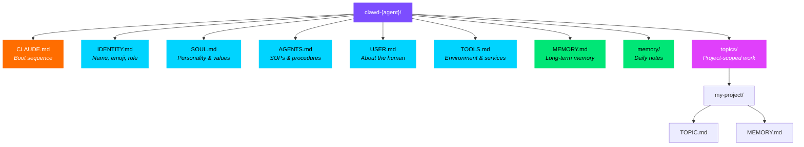
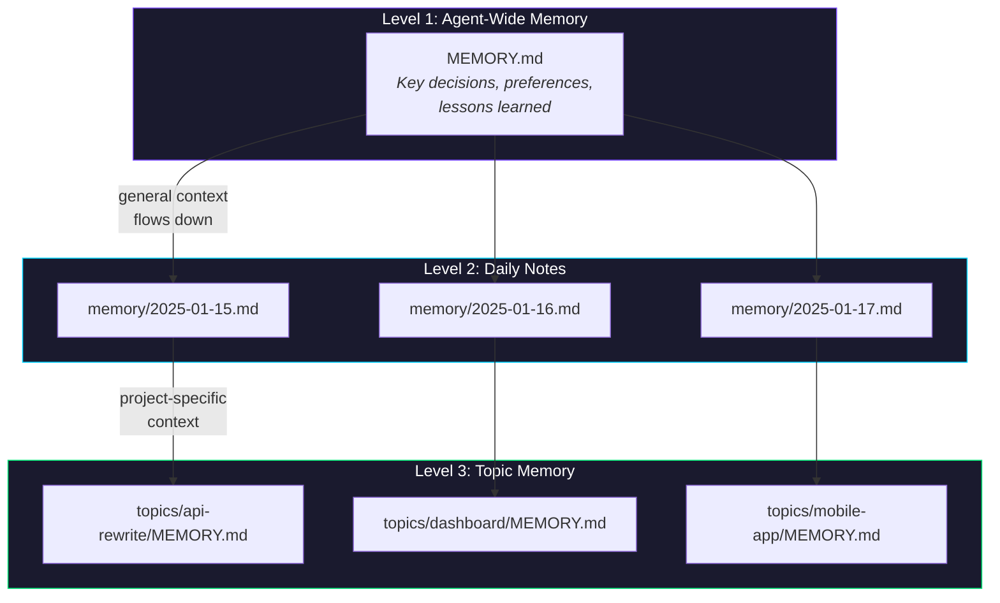

# ClawHive Architecture

A deep dive into how ClawHive turns markdown files and filesystem conventions into a multi-agent system for Claude Code.

---

## Table of Contents

- [System Overview](#system-overview)
- [Agent Anatomy](#agent-anatomy)
- [Memory Hierarchy](#memory-hierarchy)
- [Topic System](#topic-system)
- [Command Center Architecture](#command-center-architecture)
- [Skills System](#skills-system)
- [Design Principles](#design-principles)

---

## System Overview

ClawHive follows a **dispatcher pattern**. A root `CLAUDE.md` file acts as a router: when a user names an agent, the dispatcher reads that agent's workspace and adopts its personality, domain expertise, and operating procedures. Each agent workspace is a `clawd-{name}/` directory containing standardized markdown files. Shared resources (skills, templates, knowledge) live in a common directory accessible to all agents.

```mermaid
graph TB
    User([User]) -->|"@coding" / "@researcher" / browser| Dispatcher["CLAUDE.md<br/>Dispatcher"]
    User -->|http://localhost:3096| CC["Command Center<br/>(Web Dashboard)"]

    Dispatcher -->|reads workspace| A1["clawd-coding/"]
    Dispatcher -->|reads workspace| A2["clawd-researcher/"]
    Dispatcher -->|reads workspace| A3["clawd-designer/"]
    Dispatcher -->|reads workspace| AN["clawd-.../"]

    CC -->|spawns PTY session| PTY["node-pty"]
    PTY -->|runs claude CLI| Claude["Claude Code"]
    Claude -->|reads| A1

    A1 --> Shared
    A2 --> Shared
    A3 --> Shared

    subgraph Shared["Shared Resources"]
        SK["skills/"]
        KB["knowledge/"]
        TPL["templates/"]
    end

    style User fill:#7c4dff,color:#fff,stroke:#7c4dff
    style CC fill:#00d4ff,color:#000,stroke:#00d4ff
    style Dispatcher fill:#ff6d00,color:#fff,stroke:#ff6d00
    style Shared fill:#1a1a2e,color:#fff,stroke:#444
```

### How It Works

1. The user opens Claude Code in the home directory (where the dispatcher `CLAUDE.md` lives) or launches an agent from the Command Center web dashboard.
2. The dispatcher receives an agent name (e.g., `@coding`, `@researcher`) and optionally a topic.
3. It reads the target agent's workspace files in a defined boot sequence.
4. Claude adopts the agent's identity, personality, operating procedures, and memory.
5. All work happens inside the agent's workspace directory.
6. At session end, memory files are updated for continuity.

There are two ways to interact with agents:

- **Terminal (direct):** `cd ~/clawd-coding && claude` -- Claude reads the local `CLAUDE.md` and boots as that agent.
- **Command Center (web):** The dashboard spawns a PTY process running `claude` inside the agent's workspace, streamed to the browser via WebSocket.

---

## Agent Anatomy

Every agent is defined by **six markdown files** plus a memory file. No code. No config objects. Just `.md` files that Claude reads at session start.



### File-by-File Breakdown

| File | Purpose | Who Writes It |
|------|---------|---------------|
| **CLAUDE.md** | Boot sequence -- tells Claude which files to read and in what order. Includes session end protocol and universal rules. This is the entry point. | Template (rarely edited) |
| **IDENTITY.md** | The agent's name, emoji, role title, vibe keywords, and core competencies. This is the "business card" -- it defines *who* the agent is. Also parsed by the Command Center for agent discovery. | You, once |
| **SOUL.md** | Personality, communication style, values, strengths, and anti-patterns. This is the file that makes agents *feel different* from each other. A research agent's SOUL.md emphasizes thoroughness and skepticism; a coding agent's emphasizes pragmatism and shipping. | You, once (agent can evolve it) |
| **AGENTS.md** | The operating manual. Standard operating procedures, responsibilities, memory strategy, workflow conventions, file structure reference. Think of it as the employee handbook. | You, then agent refines |
| **USER.md** | Information about the human operator -- name, timezone, preferences, working style. Helps the agent tailor its behavior. | You (per user) |
| **TOOLS.md** | Environment details -- OS, shell, available services, API keys, credentials references. The agent's awareness of what tools it can reach. | You (per machine) |
| **MEMORY.md** | Long-term memory. Key decisions, learned preferences, recurring patterns. Updated automatically at the end of sessions. This is how agents persist across conversations. | Agent (automatically) |

### The Boot Sequence

When Claude starts in an agent workspace, `CLAUDE.md` instructs it to read files in this exact order:

1. `IDENTITY.md` -- establishes who the agent is
2. `SOUL.md` -- loads personality and communication style
3. `AGENTS.md` -- loads operating procedures
4. `USER.md` -- learns about the human
5. `TOOLS.md` -- learns the environment
6. `MEMORY.md` -- restores continuity from past sessions

The directive is: **"Absorb and become. Don't summarize back."** The agent should internalize these files silently and start working, not recite what it read.

---

## Memory Hierarchy

ClawHive uses a three-tier memory system, from broadest to most specific:



### Level 1: Root MEMORY.md

The agent's long-term memory. Contains curated information that spans all sessions and all topics:

- Key decisions and their reasoning
- Learned user preferences
- Recurring patterns and conventions
- Important lessons from past work

This file is read at every session start. It should stay concise and high-signal.

### Level 2: Daily Notes (memory/YYYY-MM-DD.md)

Raw session logs organized by date. Contains:

- What was worked on that day
- Commands run, files changed
- Debugging details and one-off fixes
- Context that might be useful short-term but not worth curating into root memory

Agents typically read today's and yesterday's notes for recent context.

### Level 3: Topic Memory (topics/{topic}/MEMORY.md)

Project-specific memory for isolated workstreams. Contains:

- Session-by-session progress for that project
- Current state of the work
- Open questions and next steps
- Decisions made within the project scope

This is the most granular level. Each topic is self-contained -- you can pick up a project weeks later and have full context.

### Session End Protocol

The **critical rule** in ClawHive is: before ending any session where real work happened, the agent **must** update the appropriate memory file. The format is standardized:

```markdown
## Session: YYYY-MM-DD

### What was done
- Implemented the new API endpoint for user profiles
- Fixed the timezone bug in the scheduler

### Current state
- API endpoint is working, needs integration tests
- Scheduler fix deployed to staging

### Next steps
- Write integration tests for the profile endpoint
- Monitor staging for 24 hours before production deploy
```

New sessions are appended to the **top** of the file (newest first), so the most recent context is always what the agent reads first.

**Which file gets updated:**

- Working on a topic? Update `topics/{topic}/MEMORY.md`
- General work with no specific topic? Update the root `MEMORY.md`
- Significant daily work? Optionally write to `memory/YYYY-MM-DD.md`

---

## Topic System

Topics provide **project isolation within an agent**. A single agent (e.g., your coding agent) might work on multiple projects simultaneously -- an API rewrite, a dashboard redesign, a mobile app. Topics keep these workstreams separate.

### Topic Structure

```
clawd-coding/
└── topics/
    ├── api-rewrite/
    │   ├── TOPIC.md        # What this project is, goals, constraints
    │   └── MEMORY.md       # Session-by-session progress
    ├── dashboard/
    │   ├── TOPIC.md
    │   └── MEMORY.md
    └── mobile-app/
        ├── TOPIC.md
        └── MEMORY.md
```

### TOPIC.md

The project brief. Contains:

- What the project is
- Goals and success criteria
- Technical constraints and decisions
- Key files and directories
- Links to external resources

This file is written once and updated occasionally. It provides the "what are we building and why" context.

### Topic MEMORY.md

Session continuity for this specific project. Same format as the root memory, but scoped to this topic. This is what lets you say `@coding api-rewrite` after two weeks and pick up exactly where you left off.

### Loading a Topic

When a user loads an agent with a topic (e.g., `@coding api-rewrite`), the boot sequence adds two extra reads:

1. Read `topics/api-rewrite/TOPIC.md` for project context
2. Read `topics/api-rewrite/MEMORY.md` for session history

The agent then focuses its work on that topic's domain.

### Topic Discovery

The Command Center discovers topics by scanning the `topics/` directory in each agent workspace. Topics appear as selectable options on agent cards in the dashboard.

---

## Command Center Architecture

The Command Center is a web-based dashboard for launching and managing agent sessions. It runs as a Node.js server with real-time terminal streaming.

### Tech Stack

| Component | Technology | Purpose |
|-----------|-----------|---------|
| HTTP Server | Express.js | REST API + static file serving |
| Terminal Emulation | node-pty | Spawn and manage pseudo-terminal processes |
| Frontend Terminal | xterm.js | Render terminal output in the browser |
| Real-Time Communication | WebSocket (ws) | Stream PTY output to browser, send user input back |

There is no build step, no bundler, and no frontend framework. The public directory serves raw HTML, CSS, and JavaScript.

### Request Flow

```mermaid
sequenceDiagram
    participant Browser
    participant Express as Express Server
    participant PTY as node-pty
    participant Claude as Claude CLI
    participant FS as Agent Workspace

    Note over Browser,FS: Agent Discovery
    Browser->>Express: GET /api/agents
    Express->>FS: Scan ~/clawd-* directories
    FS-->>Express: List of directories with IDENTITY.md
    Express->>FS: Parse each IDENTITY.md
    FS-->>Express: Name, emoji, role, vibe
    Express-->>Browser: JSON array of agents

    Note over Browser,FS: Session Creation
    Browser->>Express: POST /api/sessions {agentId, topic, cols, rows}
    Express->>PTY: spawn("claude", {cwd: ~/clawd-{agent}})
    PTY->>Claude: Start Claude CLI process
    Claude->>FS: Read CLAUDE.md (boot sequence)
    Claude->>FS: Read IDENTITY.md, SOUL.md, AGENTS.md...
    Express-->>Browser: {sessionId}

    Note over Browser,FS: Terminal Streaming
    Browser->>Express: WebSocket upgrade /ws/terminal/{sessionId}
    Express->>Express: attachClient(sessionId, ws)
    Express-->>Browser: Replay scrollback buffer
    loop Real-time I/O
        Claude->>PTY: Terminal output
        PTY->>Express: onData callback
        Express->>Browser: ws.send(data)
        Browser->>Express: ws.send(keystroke)
        Express->>PTY: pty.write(data)
    end

    Note over Browser,FS: Session Reconnection
    Browser->>Express: WebSocket /ws/terminal/{sessionId}
    Express-->>Browser: Replay full scrollback buffer (200KB)
    Note right of Browser: Terminal state restored
```



### Agent Discovery

The server discovers agents at runtime by scanning the user's home directory:

1. List all directories matching the `clawd-*` prefix
2. Filter to those containing an `IDENTITY.md` file
3. Parse `IDENTITY.md` to extract name, emoji, role, and vibe
4. Scan `topics/` subdirectory for available topics
5. Return the full agent list sorted alphabetically

This happens on every `GET /api/agents` call -- no registration, no database. Add a new agent directory and it appears automatically.

### PTY Session Management

Sessions are the core abstraction. Each session represents a running Claude CLI process inside an agent workspace.

**Key behaviors:**

- **One session per agent (or agent+topic pair).** The session ID is `agentId` or `agentId:topic`. Creating a session for an agent that already has one returns the existing session.
- **Sessions survive browser disconnects.** When a WebSocket client disconnects, the PTY process keeps running. The user can reconnect later and see the full scrollback.
- **Scrollback buffer.** Each session maintains a 200KB circular buffer of terminal output. New clients receive the full buffer on connect for seamless reconnection.
- **Multi-client support.** Multiple browser tabs can connect to the same session. PTY output fans out to all connected WebSocket clients.
- **Session history.** All output is written to a log file in `~/.clawhive/history/` for post-session review.
- **CURRENT_TASK.md.** The server periodically writes the last 2000 characters of output to the agent's `CURRENT_TASK.md`, so the agent can reference it if restarted.
- **Configurable limits.** Maximum concurrent sessions (default 8), scrollback size, history directory, and workspace prefix are all configurable via environment variables.

### WebSocket Protocol

The WebSocket connection at `/ws/terminal/{sessionId}` handles two message types:

- **JSON control messages:** `{"type": "resize", "cols": 120, "rows": 30}` for terminal resize events.
- **Raw text:** Everything else is treated as terminal input and written directly to the PTY.

Server-to-client messages are raw terminal output (including ANSI escape codes) plus an optional JSON `{"type": "session_ended", "exitCode": 0}` when the process exits.

Keepalive pings are sent every 30 seconds to prevent proxy and firewall timeouts.

---

## Skills System

Skills are reusable capability modules -- structured instructions that any agent can reference. They live in a shared directory accessible to all workspaces.

### Skill Structure

```
skills/
├── code-review/
│   └── SKILL.md
├── architecture/
│   └── SKILL.md
├── brainstorming/
│   └── SKILL.md
└── morning-standup/
    ├── SKILL.md
    └── checklist.md
```

### SKILL.md Format

A skill definition contains:

- **Purpose:** What the skill does
- **When to use:** Triggers or situations where this skill applies
- **Procedure:** Step-by-step instructions for executing the skill
- **Inputs:** What information is needed
- **Outputs:** What the skill produces
- **Examples:** Sample invocations and results

### How Agents Use Skills

Skills are referenced in agent files (typically `AGENTS.md` or `TOOLS.md`) with a path to the shared skill directory. When an agent needs a capability, it reads the relevant `SKILL.md` and follows its instructions.

This is purely convention-based -- there is no skill registry or import system. An agent references a skill by reading a markdown file, the same way it reads its own identity files.

### Why Shared Skills?

- **Consistency:** All agents follow the same code review process, the same brainstorming methodology, the same standup format.
- **Maintainability:** Update a skill once, all agents benefit.
- **Composability:** Agents can combine multiple skills for complex tasks.
- **Discoverability:** Browse the skills directory to see all available capabilities.

---

## Design Principles

### Convention Over Configuration

Agents are discovered by filesystem convention (`clawd-*` prefix + `IDENTITY.md`), not by a configuration file. Topics are discovered by scanning `topics/` subdirectories. Skills are found by reading directories. There is no central registry to keep in sync.

### Markdown-First

Every piece of agent definition, memory, and configuration is a markdown file. Markdown is:

- **Human-readable** -- you can open any file and understand it immediately
- **Version-controllable** -- git diffs are meaningful
- **LLM-native** -- Claude processes markdown natively with no parsing layer
- **Editable anywhere** -- any text editor, any device, no special tooling

### Filesystem as Database

Agent state lives in the filesystem, not in a database. Memory is `.md` files. Session history is `.log` files. Agent definitions are directories. This means:

- **Zero infrastructure** -- no database to set up, no migrations to run
- **Portable** -- copy a directory to move an agent
- **Inspectable** -- `ls` and `cat` are your database client
- **Backupable** -- standard filesystem backup tools work

### Zero Dependencies for Agent Definitions

Creating an agent requires exactly zero code, zero dependencies, and zero configuration beyond markdown files. The Command Center has dependencies (Express, node-pty, ws), but agents themselves are pure text. You can run a ClawHive agent with nothing but Claude Code and a directory of `.md` files.

### Separation of Identity and Infrastructure

Agent definitions (who the agent is, how it thinks, what it remembers) are completely separate from the infrastructure that runs them (the Command Center, the dispatcher). You can:

- Run agents directly from the terminal without the Command Center
- Swap the Command Center for a different UI
- Move agent workspaces between machines by copying directories
- Version-control agents independently of the platform

### Additive Memory

Memory accumulates, it never destructively overwrites. New sessions prepend to memory files (newest first). Daily notes create new files rather than editing old ones. This creates a complete audit trail and prevents accidental context loss.

---

## Environment Variables

The Command Center and setup scripts support these environment variables:

| Variable | Default | Description |
|----------|---------|-------------|
| `PORT` | `3096` | Command Center HTTP/WebSocket port |
| `WORKSPACE_PREFIX` | `clawd-` | Directory prefix for agent workspaces |
| `MAX_SESSIONS` | `8` | Maximum concurrent PTY sessions |
| `HISTORY_DIR` | `~/.clawhive/history` | Directory for session log files |
| `SKIP_DIRS` | (empty) | Comma-separated workspace names to ignore |
| `CLAUDE_BIN` | `claude` | Path to the Claude CLI binary |
